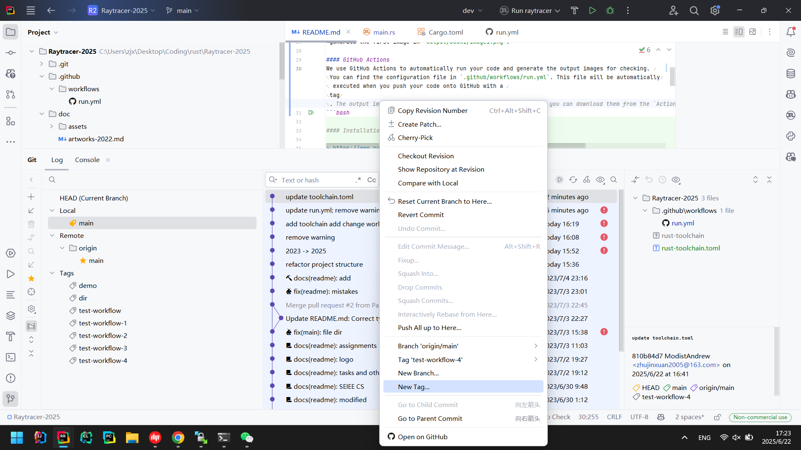
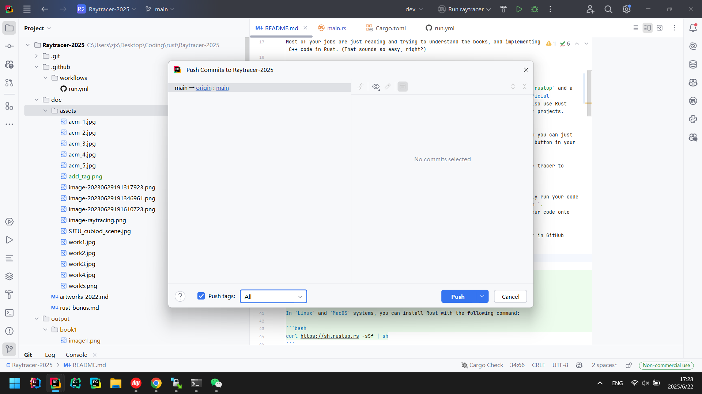
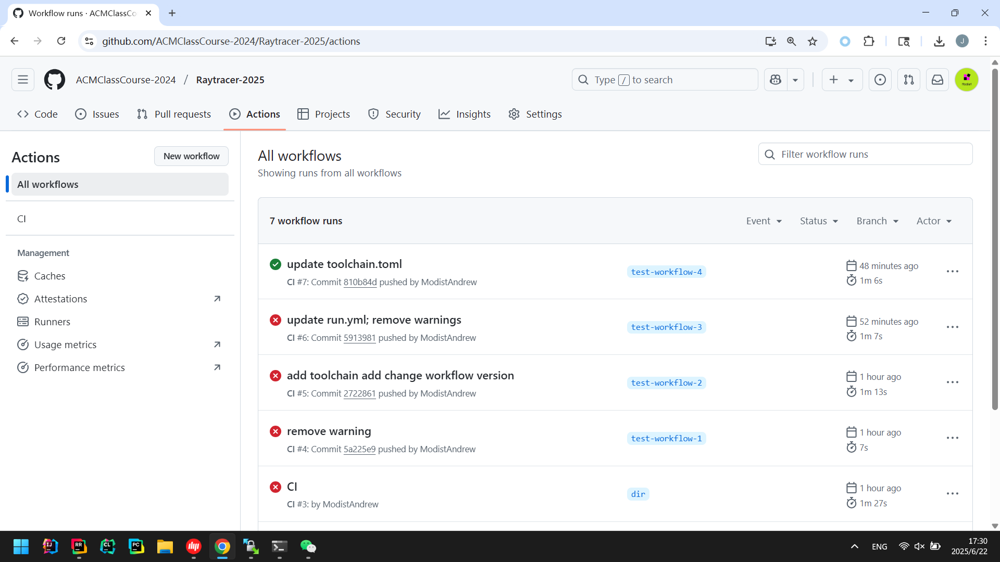
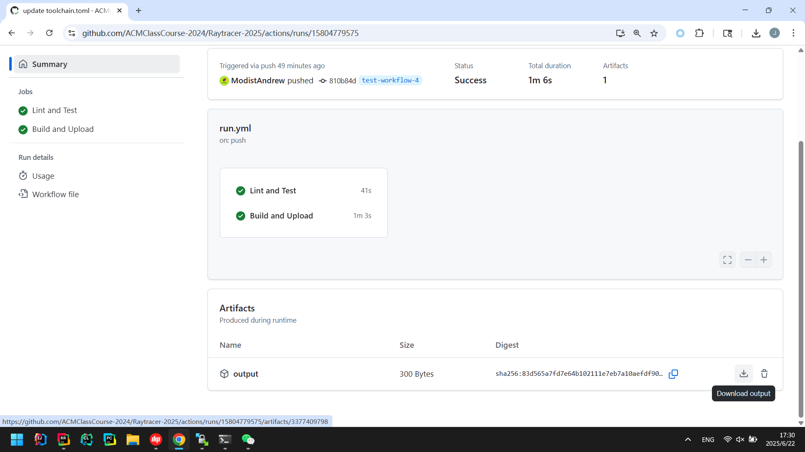

# Summer-Ray-Tracer

> SJTU ACM Honors Class 2025 Ray Tracer Project with Rust!

**Before you start, please read this README carefully**, and there is no useless information in this document.

### Introduction

Briefly, you need to build a toy ray tracer in this project with the Rust language.

### Where can you Learn about Ray Tracing?

Our project is based on the [***Ray Tracing In One Weekend***](https://raytracing.github.io/) book series, containing three books, which is a great resource for beginners to learn about ray tracing.

Most of your jobs are just reading and trying to understand the books, and implementing the books' C++ code in Rust. (That sounds so easy, right?)

### Quick Start

#### Rust Installation
Rust is a modern programming language with a convenient version control tool called `rustup` and a powerful package manager called `cargo`. Simply follow the instructions on [Rust official website](https://www.rust-lang.org/tools/install) for their installation. You may also use Rust IDEs (we recommend [RustRover](https://www.jetbrains.com/rust/)) to manage your Rust projects.

#### The First Output
We have already implemented the first image output of the first book in `main.rs`, so you can just run the following commands to see the first output image (or simply click the `Run` button in your IDE):
- `cargo run`

This will automatically set up the environment and compile the code, then run the ray tracer to generate the first image in `output/book1/image1.png`.

#### GitHub Actions
You need to share your code on GitHub, and we will use GitHub Actions to automatically run your code and generate the output images for checking. You can find the configuration file in `.github/workflows/run.yml`. This file will be automatically executed when you push your code onto GitHub with an arbitrary tag.

Following are instructions on how to create a tag, push your code, and see the result in GitHub Actions (we use RustRover as an example):

1. Enable GitHub Actions in your repository first.
2. Create a tag for your local commit.

3. Push the code together with the tag.

4. Check the GitHub Actions page to see if your code runs successfully.

5. Download the output images from the `Artifacts` section.


Or you can use the command line to create a tag and push it to GitHub:
```bash
git commit -m "Your commit message"
git tag -a your_tag_name -m "Your tag message"  # Create a tag for the current commit
git tag # List all tags
git push origin your_tag_name  # Push the tag to GitHub
git push origin main  --follow-tags  # Push the main branch and all tags to GitHub
git push origin --tags  # Push all tags to GitHub, if you pushed the code without tags before
```

### The Framework of the Project
```
.
├── Cargo.lock
├── Cargo.toml
├── doc
├── .github
│   └── workflows
│       └── run.yml
├── .gitignore
├── LICENSE
├── output
│   ├── book1
│   │   └── image1.jpg
│   ├── book2
│   ├── book3
│   └── works
├── src
│   └── main.rs
├── assets
├── README.md
└── rust-toolchain.toml
```

We strongly recommend you to keep this framework to build your project, as you can see, this framework is already simple enough, and you can add your own code in the `src` folder.

- `doc`: A folder to contain your report
- `output`: A folder to contain your output images
  - Each book has its own folder, which contains all the images shown in the chapters but should be generated by your own ray tracer
  - This folder should not be uploaded to `Github`, as it may be too large or change too frequently, so it should be added to `.gitignore`
- `.github/workflows/run.yml`: This file is used to run your code in `Github Actions`, which is a CI/CD tool.
  By the way, `output` folder can be generated automatically by `Github Actions`.
- `src`: This folder contains you main code
- `assets`: If you want to import some 3D models or textures, you can put them in this folder
- `rust-toolchain.toml`: Specify the Rust version for your project. Do not forget to add this file to your project, or you may not be able to compile your code

### Rust Language

#### Grammar Study

This is probably your first time to use Rust, so there are some resources for you to learn Rust:

- [*Rust Programming Language*](https://doc.rust-lang.org/book/title-page.html) is the most used book for a beginner
  - [*Rust 程序设计语言 简体中文版*](https://kaisery.github.io/trpl-zh-cn/title-page.html), the Chinese translation
- [*Rust 语言圣经*](https://course.rs/about-book.html)
- [*The Cargo Book*](https://doc.rust-lang.org/cargo/index.html)
- [*Rust By Example*](https://doc.rust-lang.org/rust-by-example/index.html)
- [*Rust Nomicon*](https://doc.rust-lang.org/nomicon/index.html) is for advanced users. E.g. you can learn how to write unsafe code in Rust

#### Something you should know about Rust

- `Module` instead of `include`
- `Trait` instead of `inheritance`
- Syntactically similar to C++
- Well designed, ensuring memory safe without garbage collection
- Strict compile-time check
- Ownership, lifetime, borrow checker, smart pointers...
- Hard to learn...

### Tasks

#### Task 0: Preparation

Just do some preparation work, including:

- Read the **README** carefully, so that you know how to start your project
- Correctly install Rust and Cargo
- Figure out how to compile rust code, using `rustc` or `cargo`
- Learning Rust language. Read a few chapters of the `Rust Programming Language` book
    - The first 6 chapters are enough for you to start your project
    - Chapter 10, 15, 16... the more, the better
    - Maybe at first you just know how to write a `Hello World` program or how to output the first image in the book, as long as you can complete the current task, it is enough

#### Task 1 (20 pts): *Ray Tracing In One Weekend*

- Complete [the first book](https://raytracing.github.io/books/RayTracingInOneWeekend.html)
- Save each output image in the `output` folder

#### Task 2 (20 pts) : *Ray Tracing: The Next Week*

- Complete [the second book](https://raytracing.github.io/books/RayTracingTheNextWeek.html)
- Save each output image in the `output` folder

#### Task 3 (40 pts): Advanced features
- We divide suggested advanced features for your ray tracer into four parts: [rendering](./doc/rendering-bonus.md), [geometry](./doc/geometry-bonus.md), [animation](./doc/animation-bonus.md), and [optimization](./doc/optimization-bonus.md).
- The points given are just a reference. Final points will be given based on the workload as well as the quality of your work. (We use a question mark to indicate that the points are not fixed.)
- Please contact TAs if you have any ideas about some other interesting features that you want to implement.

#### Final scene (10 pts)
- Finally, you will need to create some kind of beautiful image with your ray tracer. Beauty is of course in the eye of the beholder, but generally we are looking for clear effort in the generation of one special "capstone" image for this assignment, beyond just basic debugging/confirming that the technical features work. Great artworks will get you extra points.
- For this part you may use whatever resources you like, such as free COLLADA files from places like TurboSquid (or any other free online resource); you may also find it helpful to use free software like Blender to assemble a scene. 
- Your final scene can act as a banner or a logo of our project `Ray Tracing`. Look at the current banner at the top of this page, you can make a better one, with your own ray tracer.
- Your final result should be a picture or video (if you implemented animation) in any format you like. Hand in the final result to TAs before the deadline.
- You may contact TAs if you need calculation resources; but first try to optimize your code to run on your own computer.
- You can refer to [artworks](./doc/artworks.md) from the previous years for some inspiration.

#### Presentation (10 pts)
- There will be at most 2 students to do presentations. They will get extra points based on their presentations, no more than 10 points.

#### Code review (10 pts)

### Requirements
#### Task 1 & Task 2
- Each book's generated images should be provided. Each image output commit should be tagged, if tagged, `run.yml` settings will run your code and generate the output images. You should **let us directly see the output images (a '.zip' file) in the `Github Actions` page**.
- Your code committed should pass the checks in `Github Actions`, including (already included in `run.yml`):
  - `cargo fmt -- --check`
  - `cargo clippy --all-targets --all-features -- -D warnings`
  - `cargo test --all-features`
  - `cargo build --release --all-features`
  - `cargo run --release`
- You may run these commands locally to check your code before pushing it to GitHub.
#### Task 3
- You should have a document recording all the bonus you have done briefly. For each bonus, you should show the code or a benchmark of your work.

### Timeline
- Recommended schedule:
  - **Day 1 - 2:**  Task 0: Environment setup & Learn Rust
  - **Day 3 - 5:** Task 1
  - **Day 6 - 8:** Task 2
  - **Day 9 - 19:** Task 3 & Final Scene
  - **Day 20:** Presentation & Code Review
- **Deadline: 2025-07-17 23:59:59**

### More Tips
- You may run `cargo fmt` to format your code locally before pushing it to GitHub.
- You may need to use `cargo run --release` to accelerate the precedure.
- There is no restriction on unsafe code, if you think it is necessary, you can use it, and explain why you need it in code review.
