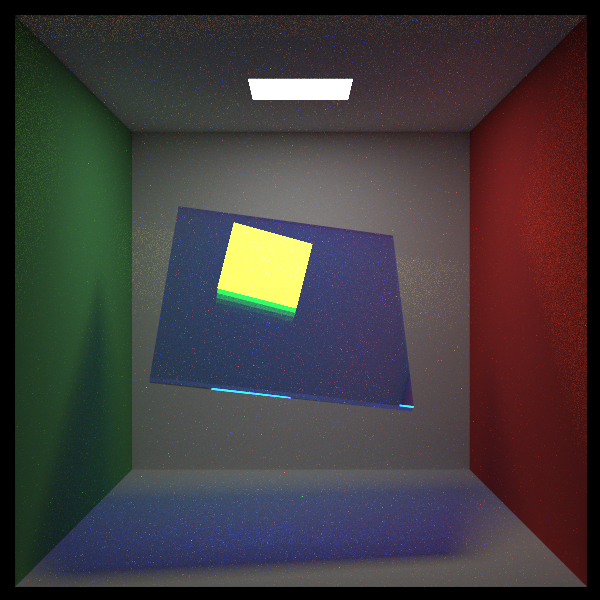
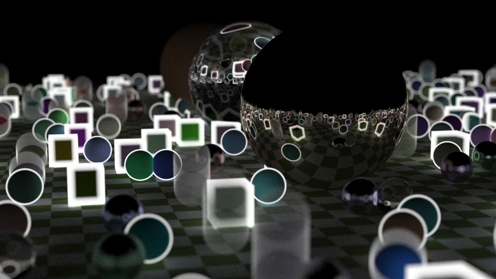

### PDF Method (20 pts)
PDF method is an important technique in ray tracing. It not only improves the efficiency of rendering but also helps understand the underlying physics principles. In [the third book](https://raytracing.github.io/books/RayTracingTheRestOfYourLife.html) of *Ray Tracing In One Weekend* series, the PDF method is introduced in detail (but the given output images may not be correct!). 

To finish this task, beyond implementing the PDF method as described in the book (**15 pts**), you are also required to write a simple report about the PDF method (**5 pts**).

### Texture/Normal/Alpha Mapping (15? pts)
After you implement 3D model loading in [geometry](geometry-bonus.md), you may notice the uv coordinates in the model file. These coordinates can be used to map textures, normals, alpha channels, etc. to every point on the surface of the model, thus making the model far more precise and realistic.

The most common mapping is texture mapping, which uses a 2D image to color the surface of the model. Normal mapping uses a 2D image to modify the surface normals, creating the illusion of more complex surface details without increasing the polygon count (**5 pts**). Many other mappings can be implemented similarly, such as alpha mapping for transparency effects, light mapping for lighting effects, etc. (**5 pts**).

What's more, you can implement advanced interpolation techniques, such as bilinear or trilinear interpolation. These techniques can help you achieve smoother transitions between different texture coordinates, enhancing the visual quality of your rendered images (**5 pts**).

Even vector graphics and fonts may be supported, allowing you to render text and shapes with high precision (**? pts**).

### Advanced Materials (20? pts)
Currently, your ray tracer may only support simple materials like diffuse, metal, and glass. However, real-world materials are much more complex. You can implement advanced material models such as the Disney BSDF, which introduces dozens of parameters to simulate various material properties. You may read [this article](https://schuttejoe.github.io/post/disneybsdf/) for reference.

### Environment Lighting (10 pts)
Add support for environment lighting, which allows you to use an image as a light source. Refer to [this article](http://dalab.se.sjtu.edu.cn/gitlab/courses/scotty3d/-/blob/master/docs/pathtracer/environment_lighting.md) for details (**5 pts**). Importance sampling for environment lighting, i.e. PDF method, is also described in the article (**5 pts**).

### More Visual Effects (? pts)
Use your creativity to add more visual effects to your ray tracer, regardless of whether they follow the laws of physics. Anyway, CG is to create the illusion of reality, so unrealistic while interesting effects are highly encouraged; realistic effects in optics, such as dispersion, diffraction, and polarization, are also welcome. You can also write some post-processing effects, such as edge detection. Following are two of my works, with only a few lines of codes. See [artworks](artworks.md) and their advanced features for more inspiration. Let your imagination run wild!

